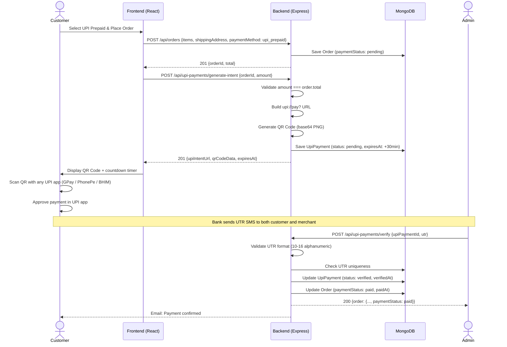
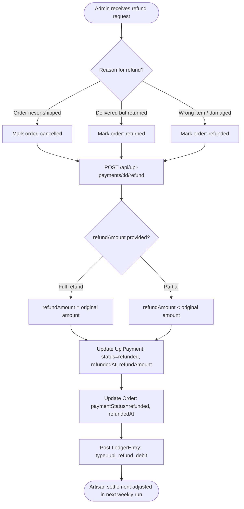
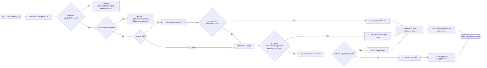
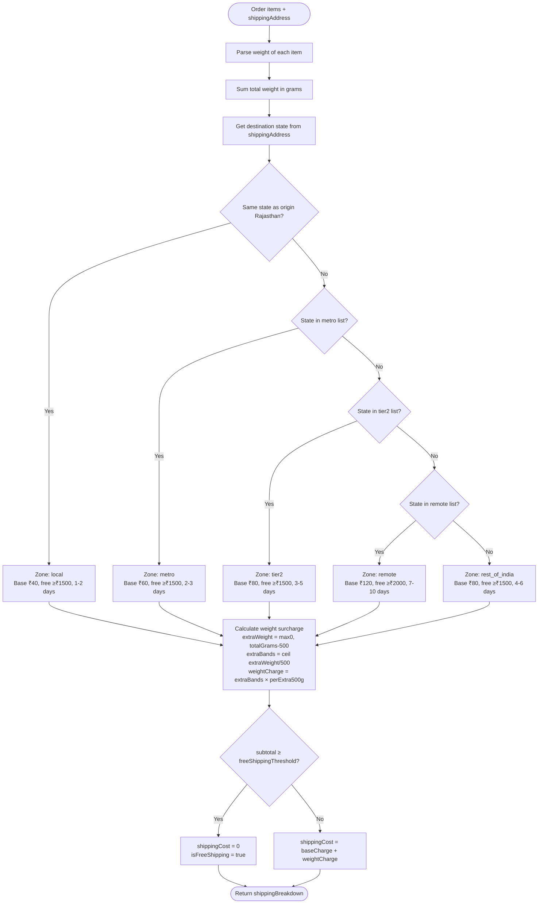
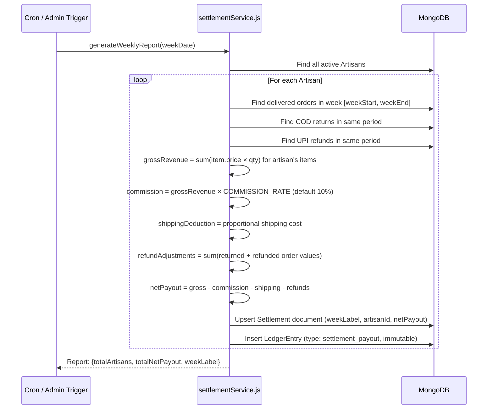

# Zaymazone — Payment Module Documentation

> **Version:** 1.0 &nbsp;|&nbsp; **Module:** 8 — Testing & Documentation &nbsp;|&nbsp; **Last Updated:** 2026-02-19

---

## Table of Contents

1. [Overview](#1-overview)
2. [Payment Methods](#2-payment-methods)
3. [UPI Prepaid — Detailed Flow](#3-upi-prepaid--detailed-flow)
4. [Cash on Delivery (COD) — Detailed Flow](#4-cash-on-delivery-cod--detailed-flow)
5. [Shipping & Logistics Engine](#5-shipping--logistics-engine)
6. [Settlement & Accounting Engine](#6-settlement--accounting-engine)
7. [API Reference](#7-api-reference)
8. [Integration Points](#8-integration-points)
9. [Security & Risk Controls](#9-security--risk-controls)
10. [Error Codes Reference](#10-error-codes-reference)
11. [Environment Variables](#11-environment-variables)
12. [Flow Diagrams](#12-flow-diagrams)

---

## 1. Overview

The Zaymazone Payment Module handles all monetary transactions between customers and artisan sellers.  It is intentionally designed around **manual verification** (no third-party gateway integration in v1) while providing a clean abstraction layer so gateways (Razorpay, Paytm, Zoho Payments) can be plugged in without changing the front-end or business logic.

### Architecture at a Glance

```
Customer Browser
    │
    ▼
React Frontend (src/services/api.ts)
    │  Firebase JWT in every request
    ▼
Express Backend  (server/src/index.js)
    ├── POST /api/upi-payments/*  → upiPayments.js  → upiService.js
    ├── POST /api/cod/*           → cod.js           → codService.js
    ├── POST /api/orders          → orders.js        → shippingService.js
    └── GET  /api/settlements/*   → settlement.js    → settlementService.js
    │
    ▼
MongoDB  (Orders, UpiPayments, LedgerEntries, Settlements)
```

### Supported Payment Methods

| Method | Gateway | Payment Timing | COD Fee | Refund Path |
|--------|---------|----------------|---------|-------------|
| `cod` | Internal | At delivery | ₹25 base | Admin marks returned → ledger debit |
| `upi_prepaid` | Manual QR | At order time | None | Admin marks refunded → ledger debit |
| `zoho_upi` | Zoho Payments | At order time | None | Zoho webhook |
| `paytm` | Paytm | At order time | None | Paytm refund API |

---

## 2. Payment Methods

### 2.1 UPI Prepaid

Customers pay upfront by scanning a dynamically generated QR code or using the `upi://` deep-link.  An admin must manually verify the payment by entering the bank-issued **UTR (Unique Transaction Reference)**.

**Key characteristics:**
- No third-party gateway fee
- 30-minute payment window (configurable via `expiryMinutes`)
- Admin verification adds human oversight to prevent fraud
- Each UTR can only be used once (unique sparse index in MongoDB)
- Supports BHIM, PhonePe, GPay, Paytm UPI, and any UPI-compatible app

### 2.2 Cash on Delivery (COD)

Customer pays cash at the doorstep when the parcel arrives. A flat handling fee is added at checkout.

**Key characteristics:**
- No prepayment required
- COD handling fee: ₹25 base (configurable via `CodConfig` model)
- Automated risk scoring built-in (new accounts, rapid orders, high return rate)
- Maximum order value: ₹10,000 (configurable)
- Certain remote states/territories may be excluded

---

## 3. UPI Prepaid — Detailed Flow

### 3.1 Happy Path

```
Step 1  Customer adds items to cart and proceeds to checkout.
Step 2  Checkout page calls GET /api/orders (draft) to calculate totals.
Step 3  Customer selects "UPI Prepaid" and clicks "Place Order".
Step 4  Frontend calls POST /api/orders → order created, paymentStatus=pending.
Step 5  Frontend calls POST /api/upi-payments/generate-intent with {orderId, amount}.
Step 6  Backend:
          a) Validates orderId belongs to authenticated user
          b) Validates amount matches order.total (tolerance ±₹0.01)
          c) Generates UPI intent URL: upi://pay?pa=merchant@paytm&pn=Zaymazone&am=<amount>&tr=<orderNumber>&cu=INR
          d) Generates QR code as base64 PNG data URL (300×300px, M error correction)
          e) Creates UpiPayment document (status: pending, expiresAt: +30min)
          f) Updates order.upiPaymentId
Step 7  Frontend displays QR code + countdown timer.
Step 8  Customer pays using any UPI app.
Step 9  Admin receives payment notification (bank app / SMS).
Step 10 Admin opens Admin Panel → Invoices or UPI Payments tab.
Step 11 Admin calls POST /api/upi-payments/verify with {upiPaymentId, utr}.
Step 12 Backend:
          a) Validates UTR format (10–16 alphanumeric chars)
          b) Checks for duplicate UTR (global unique index)
          c) Updates UpiPayment.status → verified, sets verifiedAt
          d) Updates Order.paymentStatus → paid, Order.paidAt
          e) Returns updated order
Step 13 Customer receives order confirmation email (via emailService).
```

### 3.2 Edge Cases

| Scenario | System Behaviour |
|----------|-----------------|
| Amount in request ≠ order.total | `400 Amount mismatch` — prevents partial payment |
| Order already has verified payment | `400` when generating a second intent |
| UTR contains spaces or symbols | `400 Invalid UTR format` (Zod + regex double-check) |
| Duplicate UTR | `400 DUPLICATE_UTR` with details of the existing payment |
| Payment intent expired | Intent is stale but manual verify still allowed (admin override) |
| Non-admin attempts verify | `403 Forbidden` (requireAdmin middleware) |
| Unauthenticated generate-intent | `401 Unauthorized` (authenticateToken middleware) |

### 3.3 UPI Intent URL Structure

```
upi://pay?pa=merchant@paytm&pn=Zaymazone&am=850.00&tr=ZAY-1708000000000-AB1CD&tn=Payment%20for%20Order%20ZAY-...&cu=INR

Field  Description
─────  ────────────────────────────────────────────────────────────
pa     Payee Address (merchant UPI ID, from MERCHANT_UPI_ID env var)
pn     Payee Name   ("Zaymazone" or MERCHANT_NAME env var)
am     Amount in INR, 2 decimal places
tr     Transaction Reference = Order Number
tn     Transaction Note (human-readable description)
cu     Currency = INR (required by NPCI spec)
```

### 3.4 UTR Validation Rules

```
• Length : 10–16 characters
• Charset: A–Z, 0–9 only (no spaces, hyphens, or symbols)
• Stored : uppercase, trimmed
• Index  : sparse unique — prevents duplicate-UTR fraud
• Regex  : /^[A-Za-z0-9]{10,16}$/
```

---

## 4. Cash on Delivery (COD) — Detailed Flow

### 4.1 Happy Path

```
Step 1  Customer browses products; frontend optionally calls:
          GET /api/cod/eligibility?subtotal=<n>&state=<s>&userId=<id>
        to show/hide COD option and display live fee.
Step 2  Customer selects COD and clicks "Place Order".
Step 3  Frontend calls POST /api/cod/orders with items + shippingAddress.
Step 4  Backend pipeline:
          a) Validate all products exist and are active
          b) Validate stock for each item
          c) Check COD eligibility (subtotal limit, state block list, user risk)
          d) Calculate COD fee = min(baseFee + subtotal × percentageFee / 100, maxFee)
          e) Run risk assessment (return rate, account age, rapid orders)
          f) Create Order document (paymentStatus: pending, paymentMethod: cod)
          g) Deduct stock for each line item
          h) Clear user's cart
Step 5  Response includes order + riskAssessment.isFlagged flag.
Step 6  Seller ships the order; admin updates:
          PATCH /api/cod/orders/:id/status  { status: "confirmed" }
          PATCH /api/cod/orders/:id/status  { status: "shipped", trackingNumber: "..." }
Step 7  Courier delivers; cash collected.
Step 8  Admin updates:
          PATCH /api/cod/orders/:id/status  { status: "delivered" }
        Order.paymentStatus → paid, deliveredAt = now
Step 9  Settlement engine picks up the delivered order in next weekly run.
```

### 4.2 COD Fee Calculation

```
config.baseFee        = 25       (INR, fixed per order)
config.percentageFee  = 0        (%)
config.maxFee         = 100      (INR cap)

formula:
  percentageAmount = round(subtotal * percentageFee / 100)
  rawTotal         = baseFee + percentageAmount
  totalFee         = min(rawTotal, maxFee)

Examples:
  subtotal=500   → fee = min(25 + 0, 100)  = ₹25
  subtotal=5000  → fee = min(25 + 0, 100)  = ₹25  (0% so always ₹25 base)
  subtotal=9999  → fee = min(25 + 0, 100)  = ₹25
  subtotal=10001 → COD not eligible (over maxOrderAmount)
```

### 4.3 COD Risk Assessment

The risk engine runs **non-blocking**; flagged orders are still created but marked `isFlagged: true` for admin review.

| Risk Factor | Threshold | Action |
|-------------|-----------|--------|
| High return rate | > 3 previous returns | Flag as high risk |
| New account + high value | Account < 7 days AND order > ₹3,000 | Flag |
| Rapid orders | ≥ 3 orders within 60 minutes | Flag |
| Blacklisted user | `codRiskFlags.isBlocked = true` | Reject (`COD_NOT_ELIGIBLE`) |

### 4.4 COD Return Flow

```
delivered → returned
  admin: PATCH /api/cod/orders/:id/status  { status: "returned" }
  system: creates LedgerEntry (type: cod_return_debit)
  artisan settlement for this order is excluded from next weekly run
```

---

## 5. Shipping & Logistics Engine

**Source:** `server/src/services/shippingService.js`

### 5.1 Zone Classification (Origin: Rajasthan)

| Zone | States | Base Charge | Free Shipping above | Est. Delivery |
|------|--------|-------------|---------------------|---------------|
| `local` | Same state (Rajasthan) | ₹40 | ₹1,500 | 1–2 days |
| `metro` | Delhi, Maharashtra, Karnataka, Tamil Nadu, Telangana, West Bengal, Gujarat | ₹60 | ₹1,500 | 2–3 days |
| `tier2` | Rajasthan (outbound), UP, MP, AP, Kerala, Punjab, Haryana, Bihar, Assam, etc. | ₹80 | ₹1,500 | 3–5 days |
| `rest_of_india` | Unclassified states | ₹80 | ₹1,500 | 4–6 days |
| `remote` | J&K, Ladakh, North-East states, Andaman, Lakshadweep | ₹120 | ₹2,000 | 7–10 days |

### 5.2 Weight-Based Surcharge

```
baseCharge: flat fee for first 500 g
perExtra500g charge is added for each additional 500 g (rounded up)

Weight   Zone=metro   Zone=tier2   Zone=remote
500g     ₹60          ₹80          ₹120
1 kg     ₹75          ₹100         ₹150
1.5 kg   ₹90          ₹120         ₹180
2 kg     ₹105         ₹140         ₹210
```

Weight strings supported: `"800g"`, `"1.2kg"`, `"1500"` (treated as grams), `"0.5 KG"`.

### 5.3 Courier Suggestions

| Zone | Prepaid Courier | COD Courier |
|------|----------------|-------------|
| `local` | Delhivery | Delhivery |
| `metro` | Blue Dart | Delhivery |
| `tier2` | Delhivery | DTDC |
| `rest_of_india` | DTDC | India Post |
| `remote` | India Post | India Post |

---

## 6. Settlement & Accounting Engine

**Source:** `server/src/services/settlementService.js`

### 6.1 Weekly Settlement Cycle

```
Every Monday 00:00 UTC:
  for each active Artisan:
    1. Find all orders with status=delivered and deliveredAt in [weekStart, weekEnd]
       where items.artisanId = artisan._id
    2. Calculate gross revenue = sum(item.price × item.quantity) for artisan's items
    3. Deduct platform commission (default 10%, PLATFORM_COMMISSION_RATE env)
    4. Deduct logistics pass-through (shippingCost attributed to artisan's items)
    5. Subtract refund adjustments (COD returns + UPI refunds in same period)
    6. Net payout = gross - commission - logistics - refunds
    7. Upsert Settlement document for isoWeek
    8. Post immutable LedgerEntry for audit trail
```

### 6.2 Commission Tiers

```
Default rate: 10%  (PLATFORM_COMMISSION_RATE env var)

grossRevenue = total item value sold
commission   = grossRevenue × COMMISSION_RATE
netPayout    = grossRevenue − commission − shippingDeduction − refundAdjustments
```

### 6.3 Ledger Entry Types

| Type | Direction | Description |
|------|-----------|-------------|
| `sale` | Credit | Item sold and delivered |
| `commission` | Debit | Platform commission deducted |
| `shipping_deduction` | Debit | Logistics cost pass-through |
| `cod_return_debit` | Debit | COD order returned — reverses sale |
| `upi_refund_debit` | Debit | UPI refund issued |
| `settlement_payout` | Credit | Final payout posted to artisan |

---

## 7. API Reference

### 7.1 UPI Payment Endpoints

| Method | Path | Auth | Description |
|--------|------|------|-------------|
| `POST` | `/api/upi-payments/generate-intent` | User | Generate QR code + UPI deep-link for an existing order |
| `POST` | `/api/upi-payments/verify` | Admin | Verify payment via UTR submission |
| `PATCH` | `/api/upi-payments/:id/status` | Admin | Manually change payment status |
| `POST` | `/api/upi-payments/:id/refund` | Admin | Issue refund (amount + reason) |
| `GET` | `/api/upi-payments` | Admin | List all UPI payments (paginated) |
| `GET` | `/api/upi-payments/:id` | Admin | Get single payment detail |

#### POST `/api/upi-payments/generate-intent`

```json
Request body:
{
  "orderId"       : "65f3a2b...",          // MongoDB ObjectId of the order
  "amount"        : 850.00,                // Must match order.total exactly
  "merchantUpiId" : "merchant@paytm",      // Optional; falls back to MERCHANT_UPI_ID env
  "expiryMinutes" : 30                     // Optional; 5–60, default 30
}

Response 201:
{
  "success"       : true,
  "upiPaymentId"  : "65f3b1c...",
  "upiIntentUrl"  : "upi://pay?pa=merchant@paytm&pn=Zaymazone&am=850.00&...",
  "qrCodeData"    : "data:image/png;base64,iVBOR...",
  "amount"        : "850.00",
  "orderNumber"   : "ZAY-1708000000-AB1CD",
  "expiresAt"     : "2026-02-19T14:30:00.000Z"
}
```

#### POST `/api/upi-payments/verify`

```json
Request body:
{
  "upiPaymentId"     : "65f3b1c...",
  "utr"              : "HDFC000012345678",     // 10–16 alphanumeric, no symbols
  "amount"           : 850.00,                  // Optional: actual amount paid
  "verificationNotes": "Confirmed via SMS"      // Optional, max 500 chars
}

Response 200:
{
  "success": true,
  "order"  : { ...fullOrderObject, paymentStatus: "paid" },
  "payment": { ...upiPaymentObject, paymentStatus: "verified" }
}
```

### 7.2 COD Endpoints

| Method | Path | Auth | Description |
|--------|------|------|-------------|
| `GET` | `/api/cod/eligibility` | Public | Check if COD available for subtotal + state |
| `POST` | `/api/cod/orders` | User | Place a new COD order |
| `PATCH` | `/api/cod/orders/:id/status` | Admin | Update order status through lifecycle |
| `PATCH` | `/api/cod/orders/:id/risk-flags` | Admin | Update risk flag for an order |
| `GET` | `/api/cod/orders` | Admin | List all COD orders |
| `GET` | `/api/cod/config` | Admin | Get current COD config |
| `PUT` | `/api/cod/config` | Admin | Update COD fee rules |

#### GET `/api/cod/eligibility`

```
Query params:
  subtotal  {number}  — Order subtotal in INR
  state     {string}  — Delivery state name
  userId    {string}  — Optional; enables risk check

Response 200:
{
  "eligible"     : true,
  "reason"       : null,
  "codFee"       : 25,
  "feeBreakdown" : { "baseFee": "₹25 (fixed)", "capApplied": false, "finalFee": 25 },
  "limits"       : { "maxOrderAmount": 10000, "highValueWarningThreshold": 8000 }
}
```

#### POST `/api/cod/orders`

```json
Request body:
{
  "items": [
    { "productId": "65f2...", "quantity": 2 }
  ],
  "shippingAddress": {
    "fullName"    : "Priya Sharma",
    "phone"       : "9876543210",
    "email"       : "priya@example.com",
    "addressLine1": "B-12 Sector 4",
    "city"        : "Noida",
    "state"       : "Uttar Pradesh",
    "zipCode"     : "201301",
    "country"     : "India",
    "addressType" : "home"
  },
  "useShippingAsBilling": true,
  "notes"       : "Please pack fragile item carefully",
  "isGift"      : false
}
```

### 7.3 Settlement Endpoints

| Method | Path | Auth | Description |
|--------|------|------|-------------|
| `GET` | `/api/settlements` | Admin / Seller | List settlements (admin sees all; seller sees own) |
| `POST` | `/api/settlements/run-weekly` | Admin | Trigger manual settlement run |
| `GET` | `/api/settlements/artisan/:id` | Admin | Settlement history for one artisan |
| `GET` | `/api/settlements/ledger/:artisanId` | Admin | Full ledger for one artisan |

---

## 8. Integration Points

### 8.1 Frontend ↔ Backend

| Frontend File | Backend Endpoint | Purpose |
|---------------|-----------------|---------|
| `src/pages/Checkout.tsx` | `POST /api/cod/orders` | Place COD order |
| `src/pages/Checkout.tsx` | `POST /api/upi-payments/generate-intent` | Generate UPI QR |
| `src/pages/OrderInvoice.tsx` | `GET /api/orders/:id` | Fetch order for invoice |
| `src/components/admin/AdminInvoiceView.tsx` | `GET /api/admin/orders` | List orders in admin panel |
| `src/pages/Orders.tsx` | `GET /api/orders` | Customer order history |
| `src/pages/artisan/SellerSettlement.tsx` | `GET /api/settlements` | Artisan payout history |

### 8.2 Backend Internal Service Calls

```
cod.js route
  └─ codService.isCodEligible()       — checks subtotal, state, user history
  └─ codService.calculateCodFee()     — fee formula
  └─ codService.assessCodRisk()       — risk engine
  └─ shippingService.calculateShipping() — zone + weight + free threshold

upiPayments.js route
  └─ upiService.generateUpiIntent()   — builds upi:// URL
  └─ upiService.generateQrCode()      — QRCode library → base64 PNG
  └─ upiService.validateUtr()         — regex check
  └─ upiService.calculateExpiryTime() — Date arithmetic

settlement.js route
  └─ settlementService.calculateSettlement()  — core accounting
  └─ settlementService.generateWeeklyReport() — batch all artisans
  └─ settlementService.postLedgerEntries()    — immutable audit log
```

### 8.3 Database Collections

| Collection | Key Fields | Purpose |
|------------|-----------|---------|
| `orders` | `userId`, `paymentMethod`, `paymentStatus`, `status`, `total` | Master order record |
| `upipayments` | `orderId`, `utr` (unique), `paymentStatus`, `verifiedBy` | UPI payment lifecycle |
| `settlements` | `artisanId`, `weekLabel`, `netPayout` | Weekly artisan payout |
| `ledgerentries` | `artisanId`, `type`, `amount`, `orderId` | Immutable accounting log |
| `codconfigs` | `isActive`, `baseFee`, `maxOrderAmount` | Dynamic COD fee rules |

---

## 9. Security & Risk Controls

### 9.1 Authentication

- All customer-facing write endpoints require a **Firebase JWT** (`Authorization: Bearer <token>`)
- Admin endpoints additionally require `user.isAdmin === true`
- Rate limiting applied via `apiLimiter` middleware (all `/api/upi-payments/*` and `/api/cod/*`)

### 9.2 Payment Security

| Control | Implementation |
|---------|---------------|
| Amount validation | Server re-validates payment amount against `order.total` (±₹0.01 tolerance) |
| UTR uniqueness | Sparse unique index on `UpiPayment.utr`; checked before every verification |
| Order ownership | `Order.findOne({ _id: orderId, userId })` — prevents cross-user access |
| Double-payment prevention | Existing `verified` payment blocks new intent generation |
| Admin-only verification | `requireAdmin` middleware on all `/upi-payments/verify` calls |
| Input sanitisation | Zod schema validation on all request bodies |

### 9.3 COD Risk Controls

- **High-return blacklist**: users with > 3 COD returns are flagged
- **New-account throttle**: accounts < 7 days old blocked from orders > ₹3,000
- **Rapid-order detection**: ≥ 3 orders within 60 minutes triggers flag
- **Value cap**: orders > ₹10,000 automatically ineligible for COD

---

## 10. Error Codes Reference

| HTTP | Code | Meaning |
|------|------|---------|
| 400 | `AMOUNT_MISMATCH` | Payment amount doesn't match order total |
| 400 | `DUPLICATE_UTR` | UTR has already been used for another payment |
| 400 | `INVALID_UTR_FORMAT` | UTR contains spaces, symbols, or wrong length |
| 400 | `COD_NOT_ELIGIBLE` | Order not eligible for COD (amount, state, risk) |
| 400 | `INSUFFICIENT_STOCK` | Product stock is less than requested quantity |
| 401 | — | Missing or expired Firebase JWT |
| 403 | — | User does not have admin privileges |
| 404 | — | Order or payment record not found |
| 429 | — | Rate limit exceeded (> 100 req / 15 min per IP) |
| 500 | — | Internal server error (DB connection, QR generation, etc.) |

---

## 11. Environment Variables

| Variable | Required | Default | Description |
|----------|----------|---------|-------------|
| `MERCHANT_UPI_ID` | Yes | `merchant@paytm` | UPI ID shown in QR code |
| `MERCHANT_NAME` | No | `Zaymazone` | Name shown in UPI apps |
| `PLATFORM_COMMISSION_RATE` | No | `0.10` | Artisan commission (0.0–1.0) |
| `MONGODB_URI` | Yes | — | MongoDB connection string |
| `FIREBASE_PROJECT_ID` | Yes | — | Firebase project for JWT verification |
| `NODE_ENV` | No | `development` | Enables error details in 500 responses |

---

## 12. Flow Diagrams

The following diagrams are rendered from the Mermaid source below.
They can be viewed in any Markdown renderer that supports Mermaid (GitHub, VS Code with Mermaid extension, Notion, etc.).

### 12.1 UPI Prepaid Payment Flow



### 12.2 UPI Refund Flow



### 12.3 COD Order Lifecycle

```mermaid
stateDiagram-v2
    [*] --> placed : POST /api/cod/orders
    placed --> confirmed : Admin confirms
    confirmed --> shipped : Admin adds tracking
    shipped --> delivered : Courier delivers; cash collected
    delivered --> returned : Customer returns
    placed --> cancelled : Customer / admin cancels
    confirmed --> cancelled : Admin cancels

    delivered --> [*]
    returned --> [*]
    cancelled --> [*]

    note right of placed : paymentStatus = pending
    note right of delivered : paymentStatus = paid\nOrder triggers settlement
    note right of returned : LedgerEntry cod_return_debit\nDeducted from settlement
```



### 12.4 COD Risk Assessment Flow



### 12.5 Shipping Zone & Cost Calculation



### 12.6 Weekly Settlement Flow



---

*This document is auto-generated as part of Module 8 — Testing & Documentation.*
*For implementation questions contact the Zaymazone engineering team.*
